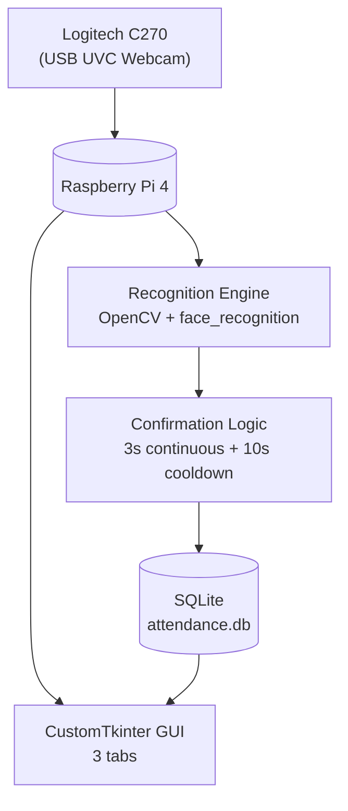
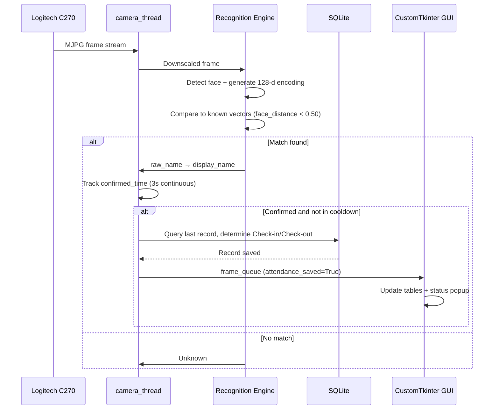

# Face Recognition Attendance System

[Tiếng Việt](./README.vi.md) | **English**

A real-time attendance system built on **Raspberry Pi 4**, using **OpenCV** and **face_recognition** to detect and identify registered faces, **SQLite** to store attendance history, and a **CustomTkinter** GUI for local operation.

---

## Overview

This project automates attendance tracking using facial recognition that:
- Captures real-time video from a **Logitech C270** USB webcam
- Detects and identifies registered faces using 128-dimensional face encodings
- Requires a face to be continuously visible for a confirmation window before logging an entry
- Automatically alternates between Check-in and Check-out based on the most recent record
- Stores attendance history locally in SQLite, with a CustomTkinter GUI for management and CSV export

**Tech stack:** Raspberry Pi 4 · Logitech C270 · OpenCV · face_recognition · CustomTkinter · SQLite

---

## System Block Diagram



**Components:**

| Component | Role |
|---|---|
| Logitech C270 | USB UVC webcam, captures 640×480 MJPG video |
| Raspberry Pi 4 | Central processor — orchestrates camera, recognition, GUI, and database |
| Recognition Engine | OpenCV + face_recognition (HOG detector), generates 128-d face encodings and compares against stored vectors |
| Confirmation Logic | Requires 3 seconds of continuous detection before logging, plus a 10-second cooldown to prevent duplicate entries |
| SQLite Database | Stores attendance history (id, name, timestamp, type) |
| CustomTkinter GUI | 3-tab interface: Attendance, Face Management, History |

---

## Hardware Image

<p align="center">
  
</p>

Raspberry Pi 4 and Logitech C270 webcam setup.

---

## GUI Interface


**Attendance tab** — live camera feed with bounding boxes, system status (FPS, recognition state, cooldown), and the most recent attendance records.


**Face Management tab** — register new people, capture face photos, retrain encodings, and view/edit/delete registered users.


**History tab** — filter attendance records by name and date, refresh, export to CSV, and clear history.

---

## Data Flow Description

1. **Detection** — A person appears in front of the camera; the Logitech C270 streams MJPG frames.
2. **Capture** — `camera_thread` reads frames from the webcam via V4L2.
3. **Preprocessing** — The frame is downscaled and face detection runs using the HOG model.
4. **Encoding & Matching** — A 128-d face encoding is generated and compared against all stored vectors using `face_distance`; the closest match under the tolerance threshold (0.50) is selected.
5. **Name Mapping** — The matched `raw_name` is mapped to a `display_name` via `people.json`.
6. **Confirmation** — The system tracks how long the person has been continuously visible; only after 3 seconds of continuous detection does it proceed to log attendance.
7. **Cooldown Check** — If the person was logged within the last 10 seconds, the system skips logging to avoid duplicates.
8. **Check-in/Check-out Determination** — The database is queried for the person's most recent record: no record or last record was Check-out → log Check-in; last record was Check-in → log Check-out.
9. **Persistence** — The new record is written to `attendance.db`.
10. **UI Update** — The result is pushed through `frame_queue`; the GUI updates the recent-attendance table and shows a status popup.



---

## Recognition & Attendance Logic

| Parameter | Value | Purpose |
|---|---|---|
| FRAME_WIDTH × FRAME_HEIGHT | 640×480 | Capture resolution |
| FOURCC | MJPG | Reduces USB bandwidth compared to YUYV |
| CV_SCALER | 4 | Downscales the frame to 1/4 size before recognition |
| PROCESS_EVERY_N_FRAMES | 8 | Runs recognition every 8th frame; other frames reuse the latest result |
| Detector model | HOG | CPU-friendly, suited for Raspberry Pi (vs. CNN) |
| TOLERANCE | 0.50 | Face distance threshold below which a match is accepted |
| Confirmation window | 3 seconds | Continuous detection required before an attendance record is logged |
| Cooldown | 10 seconds | Prevents the same person from being logged multiple times in quick succession |

If a tracked person disappears from the frame before the confirmation window completes, their `confirmed_time` entry is cleared — intermittent detection does not accumulate toward the 3-second requirement.

---

## Multi-threaded Architecture

CustomTkinter requires widget operations to run on the main thread. To keep the GUI responsive while the camera loop and training run concurrently, the system uses `threading` combined with `queue.Queue` and `root.after()`.

| Thread | Responsibility | Communication |
|---|---|---|
| Main GUI thread | Renders widgets, handles button events, updates camera feed/status/tables | Reads queues via `after()` |
| camera_thread | Opens the webcam, reads frames, runs recognition, logs attendance | `frame_queue` |
| capture_thread | Opens the webcam for the face-capture window | `capture_queue` |
| train_thread | Scans the dataset and regenerates `encodings.pickle` | `train_queue` |

> Background threads never update widgets directly — they push a dict into a queue, and the main thread reads the queue and updates the UI.

---

## Database Schema

**Table: `attendance`**

| Column | Type / Meaning |
|---|---|
| id | Auto-increment primary key |
| name | Display name (with diacritics) |
| timestamp | Time of the attendance event |
| type | Check-in or Check-out |

Key operations: `init_db()`, `insert_attendance(name)`, `get_recent_attendance(limit)`, `get_attendance_records(name_filter, date_filter)`, `clear_attendance_records()`.

---

## Features

- Real-time face detection and recognition (OpenCV + face_recognition, 128-d encodings)
- Continuous-presence confirmation (3s) with cooldown (10s) to prevent duplicate entries
- Automatic Check-in/Check-out alternation based on the most recent record
- Multi-threaded architecture (camera, capture, training) keeps the GUI responsive
- CustomTkinter GUI with 3 tabs: Attendance, Face Management, History
- Face dataset management: add/edit/delete people, capture photos, retrain encodings
- Attendance history with filtering by name/date and CSV export (UTF-8-SIG for Vietnamese)
- Safe deletion with automatic backup to `deleted_dataset/`

## Hardware Used

- Raspberry Pi 4
- Logitech C270 USB webcam
- Powered USB Hub (ORICO TWU3-4A) — optional, for power-sensitive USB devices
- microSD card

## Project Structure

```
face-recognition-attendance/
├── README.md                   # System overview (this file, English)
├── README.vi.md                 # System overview (Vietnamese)
├── scripts/
│   ├── capture_images.py          # Face photo capture window
│   ├── database.py                 # SQLite init, insert/query attendance records
│   ├── gui.py                      # Main CustomTkinter GUI, camera thread, queues
│   ├── model_trainer.py            # Wraps the encoding generation process
│   ├── people_manager.py           # Manages people.json and dataset (add/edit/delete)
│   ├── recognize.py                # Recognition logic
│   ├── test_camera_simple.py       # Standalone camera test script
│   └── train_model.py              # Standalone train/encode script
├── .gitignore
├── people.example.json             # Template for people.json (no real data)
└── images/                         # Hardware and GUI screenshots
    ├── hardware_overview.jpg
    ├── gui_attendance_tab.jpg
    ├── gui_face_management_tab.jpg
    └── gui_history_tab.jpg
```

> Runtime/generated files such as `dataset/`, `deleted_dataset/`, `encodings.pickle`, `attendance.db`, and `venv/` are excluded via `.gitignore` and will not appear on GitHub — see Security & Privacy below.

---

## Security & Privacy

- The face photo dataset is biometric data — **never push it to a public repository**.
- `attendance.db` contains personal attendance history — restrict sharing.
- The public repository should only contain source code, README, requirements, and a config template with no real data (`people.example.json` instead of `people.json`).
