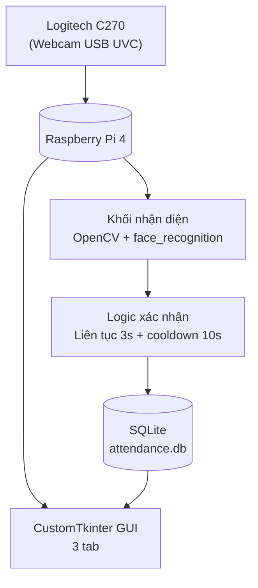
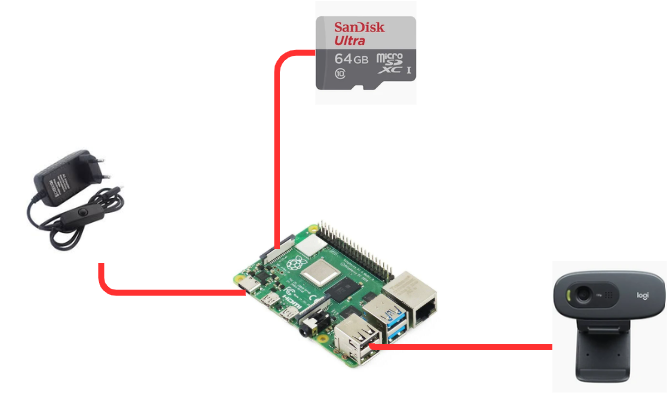
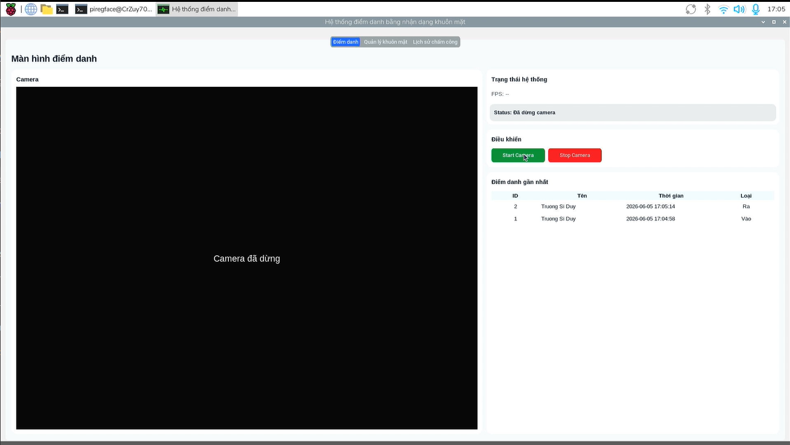
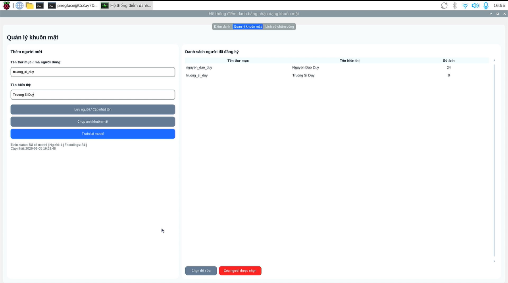
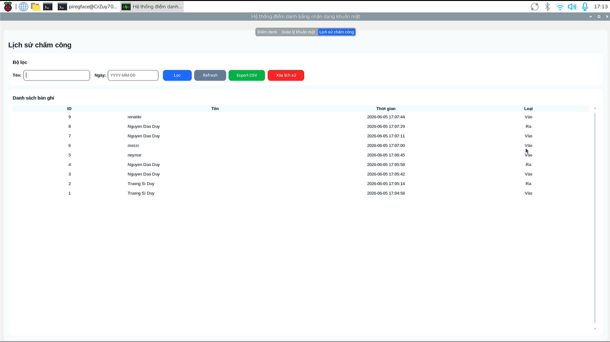
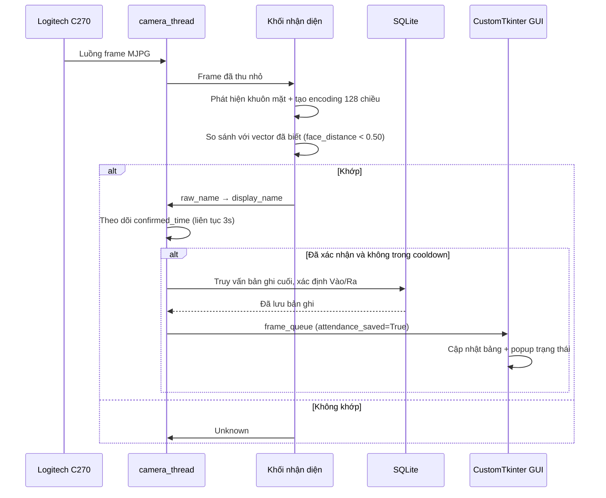

# Hệ Thống Chấm Công Bằng Nhận Diện Khuôn Mặt

**Tiếng Việt** | [English](./README.md)

Hệ thống chấm công thời gian thực xây dựng trên **Raspberry Pi 4**, sử dụng **OpenCV** và **face_recognition** để phát hiện và nhận diện khuôn mặt đã đăng ký, **SQLite** để lưu lịch sử chấm công, và giao diện **CustomTkinter** để vận hành cục bộ.

---

## Tổng Quan

Dự án này tự động hóa việc chấm công bằng nhận diện khuôn mặt:
- Thu nhận video thời gian thực từ webcam USB **Logitech C270**
- Phát hiện và nhận diện khuôn mặt đã đăng ký dựa trên vector đặc trưng 128 chiều
- Yêu cầu khuôn mặt xuất hiện liên tục đủ thời gian xác nhận trước khi ghi nhận
- Tự động xen kẽ trạng thái Vào/Ra dựa trên bản ghi gần nhất
- Lưu lịch sử chấm công cục bộ bằng SQLite, có giao diện CustomTkinter để quản lý và xuất CSV

**Công nghệ sử dụng:** Raspberry Pi 4 · Logitech C270 · OpenCV · face_recognition · CustomTkinter · SQLite

---

## Sơ Đồ Khối Hệ Thống



**Các thành phần:**

| Thành phần | Vai trò |
|---|---|
| Logitech C270 | Webcam USB UVC, thu hình 640×480 MJPG |
| Raspberry Pi 4 | Bộ xử lý trung tâm — điều phối camera, nhận diện, GUI và database |
| Khối nhận diện | OpenCV + face_recognition (HOG detector), tạo encoding 128 chiều và so sánh với vector đã lưu |
| Logic xác nhận | Yêu cầu xuất hiện liên tục 3 giây trước khi ghi, kèm cooldown 10 giây để tránh ghi trùng |
| Cơ sở dữ liệu SQLite | Lưu lịch sử chấm công (id, tên, timestamp, loại) |
| CustomTkinter GUI | Giao diện 3 tab: Điểm danh, Quản lý khuôn mặt, Lịch sử |

---

## Hình Ảnh Phần Cứng

<p align="center">
  
</p>

Bố trí Raspberry Pi 4 và webcam Logitech C270.

---

## Giao Diện GUI

**Tab Điểm danh** — hình ảnh camera trực tiếp kèm bounding box, trạng thái hệ thống (FPS, trạng thái nhận diện, cooldown), và bảng điểm danh gần nhất.



**Tab Quản lý khuôn mặt** — đăng ký người mới, chụp ảnh khuôn mặt, train lại encoding, xem/sửa/xóa người dùng đã đăng ký.



**Tab Lịch sử** — lọc lịch sử chấm công theo tên/ngày, làm mới, xuất CSV và xóa lịch sử.



---

## Mô Tả Luồng Dữ Liệu

1. **Phát hiện** — Người xuất hiện trước camera; Logitech C270 truyền frame MJPG.
2. **Thu nhận** — `camera_thread` đọc frame từ webcam qua V4L2.
3. **Tiền xử lý** — Frame được thu nhỏ và phát hiện khuôn mặt bằng mô hình HOG.
4. **Mã hóa & So khớp** — Tạo encoding 128 chiều và so sánh với toàn bộ vector đã lưu bằng `face_distance`; chọn khoảng cách nhỏ nhất dưới ngưỡng tolerance (0.50).
5. **Ánh xạ tên** — `raw_name` khớp được ánh xạ sang `display_name` thông qua `people.json`.
6. **Xác nhận** — Hệ thống theo dõi thời gian người đó xuất hiện liên tục; chỉ sau khi đủ 3 giây liên tục mới tiến hành ghi chấm công.
7. **Kiểm tra cooldown** — Nếu người đó vừa được ghi trong 10 giây gần nhất, hệ thống bỏ qua để tránh ghi trùng.
8. **Xác định Vào/Ra** — Truy vấn bản ghi gần nhất của người đó: chưa có bản ghi hoặc bản ghi cuối là Ra → ghi Vào; bản ghi cuối là Vào → ghi Ra.
9. **Lưu trữ** — Bản ghi mới được ghi vào `attendance.db`.
10. **Cập nhật giao diện** — Kết quả được đẩy qua `frame_queue`; GUI cập nhật bảng điểm danh gần nhất và hiển thị popup trạng thái.



---

## Logic Nhận Diện & Chấm Công

| Tham số | Giá trị | Mục đích |
|---|---|---|
| FRAME_WIDTH × FRAME_HEIGHT | 640×480 | Độ phân giải thu hình |
| FOURCC | MJPG | Giảm băng thông USB so với YUYV |
| CV_SCALER | 4 | Thu nhỏ frame còn 1/4 trước khi nhận diện |
| PROCESS_EVERY_N_FRAMES | 8 | Chỉ chạy nhận diện mỗi 8 frame, các frame còn lại tái sử dụng kết quả gần nhất |
| Detector | HOG | Nhẹ, phù hợp CPU Raspberry Pi (so với CNN) |
| TOLERANCE | 0.50 | Ngưỡng khoảng cách để chấp nhận là khớp |
| Thời gian xác nhận | 3 giây | Yêu cầu xuất hiện liên tục trước khi ghi chấm công |
| Cooldown | 10 giây | Tránh cùng một người bị ghi nhiều lần liên tiếp |

Nếu người đang được theo dõi biến mất khỏi khung hình trước khi đủ thời gian xác nhận, entry `confirmed_time` của họ sẽ bị xóa — xuất hiện chập chờn không cộng dồn vào yêu cầu 3 giây.

---

## Kiến Trúc Đa Luồng

CustomTkinter yêu cầu thao tác widget phải chạy trên main thread. Để giữ GUI không bị đơ trong khi vòng lặp camera và train model chạy song song, hệ thống dùng `threading` kết hợp `queue.Queue` và `root.after()`.

| Luồng | Nhiệm vụ | Kênh giao tiếp |
|---|---|---|
| Main GUI thread | Render widget, xử lý sự kiện nút, cập nhật camera/status/bảng | Đọc queue qua `after()` |
| camera_thread | Mở webcam, đọc frame, nhận diện, ghi chấm công | `frame_queue` |
| capture_thread | Mở webcam cho cửa sổ chụp ảnh khuôn mặt | `capture_queue` |
| train_thread | Duyệt dataset và tạo lại `encodings.pickle` | `train_queue` |

> Thread nền không trực tiếp cập nhật widget — nó chỉ đưa dict vào queue, main thread đọc queue và cập nhật giao diện.

---

## Cơ Sở Dữ Liệu

**Bảng `attendance`**

| Cột | Kiểu / Ý nghĩa |
|---|---|
| id | Khóa chính tự tăng |
| name | Tên hiển thị có dấu |
| timestamp | Thời điểm chấm công |
| type | Vào hoặc Ra |

Các thao tác chính: `init_db()`, `insert_attendance(name)`, `get_recent_attendance(limit)`, `get_attendance_records(name_filter, date_filter)`, `clear_attendance_records()`.

---

## Tính Năng

- Phát hiện và nhận diện khuôn mặt thời gian thực (OpenCV + face_recognition, encoding 128 chiều)
- Xác nhận xuất hiện liên tục (3s) kèm cooldown (10s) để tránh ghi trùng
- Tự động xen kẽ Vào/Ra dựa trên bản ghi gần nhất
- Kiến trúc đa luồng (camera, chụp ảnh, training) giữ GUI luôn mượt
- Giao diện CustomTkinter với 3 tab: Điểm danh, Quản lý khuôn mặt, Lịch sử
- Quản lý dataset khuôn mặt: thêm/sửa/xóa người, chụp ảnh, train lại encoding
- Lịch sử chấm công có lọc theo tên/ngày và xuất CSV (UTF-8-SIG cho tiếng Việt)
- Xóa an toàn với backup tự động vào `deleted_dataset/`

## Phần Cứng Sử Dụng

- Raspberry Pi 4
- Webcam USB Logitech C270
- Power Adapter 5V 3A USB-C
- Thẻ microSD 64GB
- Dây MicroHDMI to HDMI + Video Capture Card: hiện Raspberry OS lên màn hình laptop để có được trải nghiệm mượt mà hơn

## Cấu Trúc Project

```
face-recognition-attendance/
├── images/                         # Hình ảnh phần cứng và screenshot GUI
│   ├── hardware_overview.jpg
│   ├── gui_attendance_tab.jpg
│   ├── gui_face_management_tab.jpg
│   └── gui_history_tab.jpg
├── scripts/
│   ├── capture_images.py          # Cửa sổ chụp ảnh khuôn mặt
│   ├── database.py                 # Khởi tạo SQLite, ghi/đọc lịch sử chấm công
│   ├── gui_ctk.py                  # GUI CustomTkinter chính (đang dùng), camera thread, queue
│   ├── gui.py                      # Bản GUI cũ (legacy, không còn sử dụng)
│   ├── model_trainer.py            # Đóng gói quá trình tạo encoding
│   ├── people_manager.py           # Quản lý people.json và dataset (thêm/sửa/xóa)
│   ├── recognize.py                # Logic nhận diện
│   ├── test_camera_simple.py       # Script test camera độc lập
│   └── train_model.py              # Script train/encode độc lập
├── .gitignore
├── README.md                       # Tổng quan hệ thống (Tiếng Anh)
├── README.vi.md                    # Tổng quan hệ thống (file này, Tiếng Việt)
└── people.example.json             # Template cho people.json (không có dữ liệu thật)
```

> Các file runtime/tự sinh như `dataset/`, `deleted_dataset/`, `encodings.pickle`, `attendance.db`, `venv/` đã được loại trừ bằng `.gitignore` và sẽ không xuất hiện trên GitHub — xem mục Bảo Mật & Quyền Riêng Tư bên dưới.

---

## Bảo Mật & Quyền Riêng Tư

- Dataset ảnh khuôn mặt là dữ liệu sinh trắc học — **tuyệt đối không đưa lên repo public**.
- `attendance.db` chứa lịch sử cá nhân — hạn chế chia sẻ.
- Repo public chỉ nên chứa mã nguồn, README, requirements, và file cấu hình mẫu không có dữ liệu thật (`people.example.json` thay vì `people.json`).
